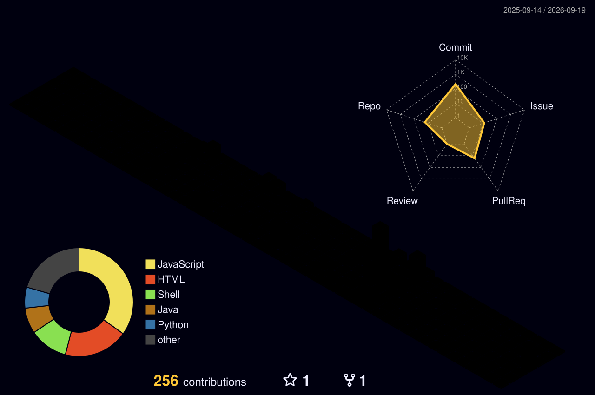

<!-- Dynamic Header Banner -->


<div align="center">

[](https://anurag-yadav.in)
[](https://www.linkedin.com/in/anuragyadav0311/)
[](https://leetcode.com/u/anurag_yadav_0311/)
[](https://codeforces.com/profile/anuragyadav0311)
[](mailto:anuragyadav47844@gmail.com)


</div>

---

##  &nbsp;`> whoami`


```yaml
name: Anurag Yadav
location: Bhilai, Chhattisgarh, India 🇮🇳
education:
  university: VIT Bhopal University
  degree: B.Tech CSE (AI & ML)
  duration: Sep 2024 – Present

current_focus:
  - Machine Learning & AI Systems
  - Full-Stack Web Development
  - Open Source Contributions
  - Competitive Programming

fun_facts:
  - I try many things at the same time ⚡
  - Linux enthusiast running Omarchy (Arch + Hyprland) 🐧
  - Love automating everything I can 🤖
```

<br clear="right"/>

---

## ⚔️ &nbsp;`> skill_tree --verbose`

<div align="center">

<table>
<tr>
<td align="center" width="33%">

**`⚡ LANGUAGES`**

<br>

<a href="https://skillicons.dev"></a>
<br>
<a href="https://skillicons.dev"></a>

<br>

```
Python    ████████████████░░  90%
C++       ██████████████░░░░  80%
Java      ████████████░░░░░░  70%
JS        ██████████████░░░░  80%
```

</td>
<td align="center" width="33%">

**`🛠️ FRAMEWORKS`**

<br>

<a href="https://skillicons.dev"></a>
<br>
<a href="https://skillicons.dev"></a>

<br>

```
React     ████████████████░░  85%
Django    ██████████████░░░░  75%
Flask     ██████████████░░░░  80%
FastAPI   ████████████░░░░░░  70%
```

</td>
<td align="center" width="33%">

**`🗄️ INFRA & TOOLS`**

<br>

<a href="https://skillicons.dev"></a>
<br>
<a href="https://skillicons.dev"></a>

<br>

```
Git       ██████████████████  95%
Linux     ████████████████░░  90%
Postgres  ██████████████░░░░  75%
Firebase  ████████████░░░░░░  70%
```

</td>
</tr>
</table>

<br>

#### 🧠 ML & Data Science Arsenal
<p>


</p>

</div>

---

## 🏗️ &nbsp;`> ls projects/ --featured`

<div align="center">
<table>
<tr>
<td width="50%" valign="top">

### 💰 [SnapSpend](https://github.com/anuragyadav0311/SnapSpend)
**Full-Stack Finance Tracker with ML Insights**

<p>


</p>

Personal finance tracker with JWT auth, budget tracking, interactive dashboards, ML anomaly detection (Isolation Forest), and OCR bill scanning via Tesseract.

</td>
<td width="50%" valign="top">

### 🛡️ [Vaxtrust](https://github.com/anuragyadav0311/Vaxtrust)
**AI-Powered Vaccine Safety Verification**

<p>


</p>

Web + mobile platform for vaccine batch QR scanning, AEFI-based trust scores, anonymous side-effect reporting, and ML-driven anomaly detection dashboards.

</td>
</tr>
<tr>
<td width="50%" valign="top">

### 📚 [Library Management System](https://github.com/anuragyadav0311/Library-Management-System)
**Console-Based C++ Library System**

<p>


</p>

Console-based system to manage books, students, and issue/return records using custom linked lists for dynamic data handling and file-based persistence.

</td>
<td width="50%" valign="top">

### 🎓 [CatXForest](https://github.com/anuragyadav0311/CatXForest)
**ML Student Career Recommendation System**

<p>


</p>

Predicts career paths from academic data using a hybrid ensemble model (Random Forest, XGBoost, CatBoost) with probability-based top-5 predictions.

</td>
</tr>
<tr>
<td width="50%" valign="top">

### 📖 [SmartStudyTracker](https://github.com/anuragyadav0311/SmartStudyTracker)
**Java Study Management App**

<p>


</p>

A Java-based study tracking application for managing and monitoring academic progress with organized session logging and performance insights.

</td>
<td width="50%" valign="top">

### 📂 [Linux DL Sorter](https://github.com/anuragyadav0311/linux-dlsorter)
**Automatic Download Organizer**

<p>


</p>

Background daemon that automatically organizes Linux downloads, sorting code and media into designated folders the moment they finish downloading.

</td>
</tr>
</table>
</div>

---

## 🏆 &nbsp;`> cat certifications.log`

<p>


</p>

---

## 📊 &nbsp;`> git stats --all`

<div align="center">


</div>

---

## 📈 &nbsp;`> git log --graph`

<div align="center">


</div>

---

## 🧊 &nbsp;`> render --3d contributions`

<div align="center">

<picture>
  <source media="(prefers-color-scheme: dark)" srcset="./profile-3d-contrib/profile-night-rainbow.svg" />
  <source media="(prefers-color-scheme: light)" srcset="./profile-3d-contrib/profile-south-season-animate.svg" />
  
</picture>

> 🔮 *Isometric 3D contribution calendar — auto-generated daily via [GitHub Actions](https://github.com/yoshi389111/github-profile-3d-contrib)*

</div>

---

<div align="center">

### 💬 *"Building intelligent systems that solve real-world problems."*

<br>


</div>
